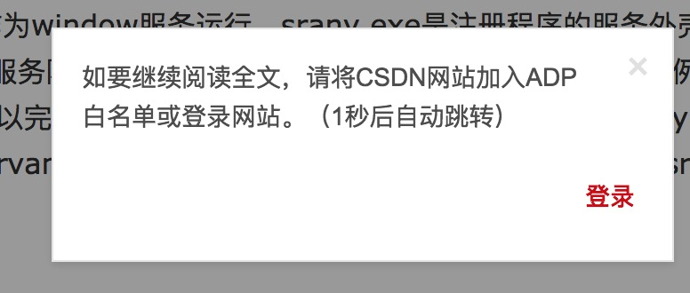
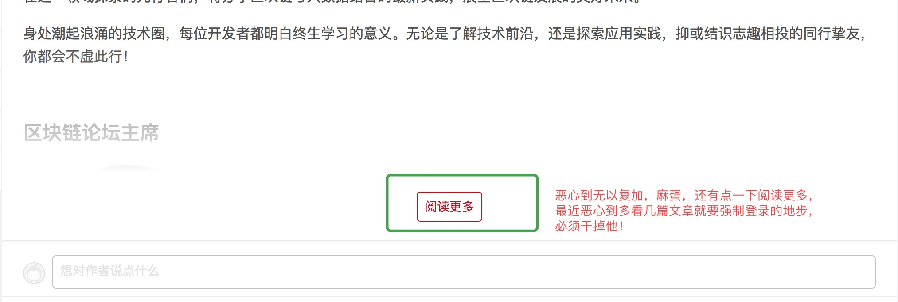
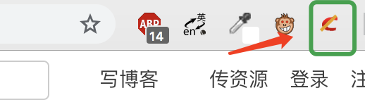
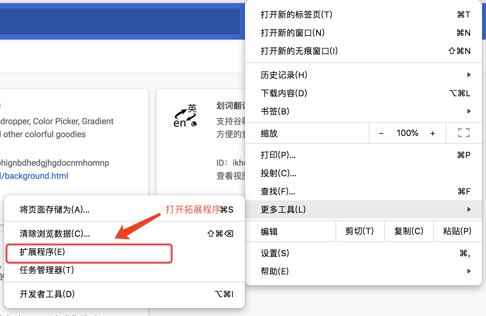
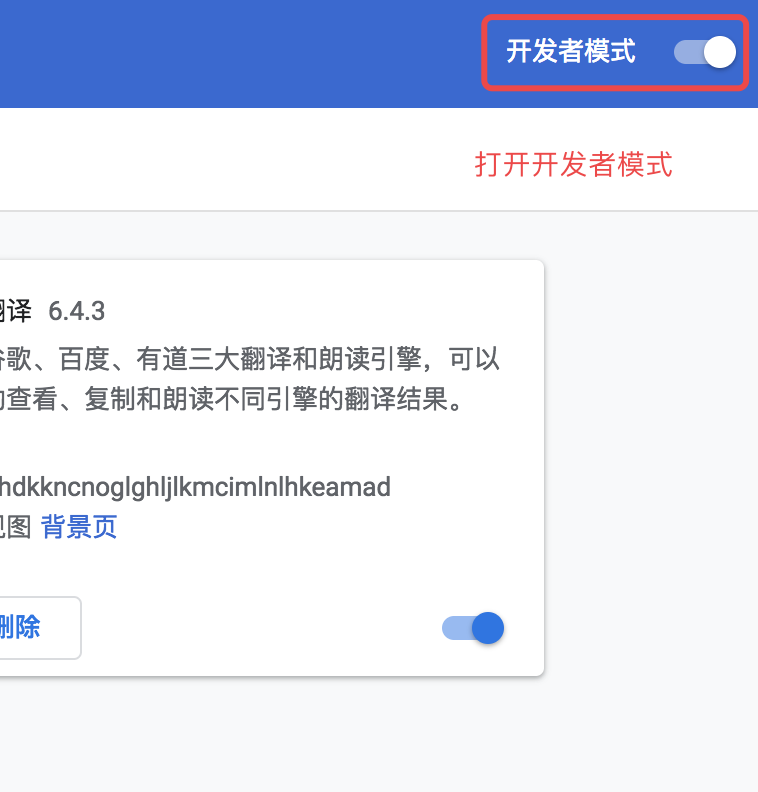
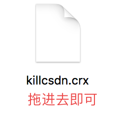

# killcsdn
> csdn最近干了两件恶心的事情：需要多点一次查看全部；浏览几次，强制登录。很不爽，于是写个插件干掉他！ 
2018年12月5日，csdn强制要求加入Adblock白名单，否则呵呵哒，果断干掉!

## 有图有真相
### 20181205新增
 
如上图所示，这玩意也干掉了！！
### old
 
插件加入后，会自动帮你点击阅读更多，并且强制登录限制没了，想看几次看几次！
 

## 使用方法
由于本人没有加入谷歌开发者，需要各位自己去编译打包
 
如上图所示，进入拓展程序，打开开发者模式，点 “打包” 或者 “加载已解压的拓展程序”，选择路径下的killcsdn文件夹即可 

1、打开chrome拓展 
   
2、打开开发者模式 
   
3、将killcsdn.crx拖进去即可 
   
## 关于
业余水平，第一次写这玩意，欢迎拍砖
 
oschina:  https://gitee.com/redsky/killcsdn
 
github: https://github.com/wws19125/killcsdn